<div align="center">
 
# 🩺 Diabetic Retinopathy Detection using Deep Learning

</div>

## 📌 Project Overview
This project focuses on detecting diabetic retinopathy from retinal fundus images using a Convolutional Neural Network (CNN). Diabetic retinopathy is a diabetes complication that affects the eyes, and early detection is crucial for preventing vision loss.

The model is trained on a balanced dataset containing 5 classes of diabetic retinopathy severity (0 to 4). The dataset is preprocessed, augmented, and fed into a CNN built with TensorFlow/Keras.

# 📂 Dataset Structure
The dataset is stored in a ZIP file (archive.zip) and contains the following structure after extraction:
```
/content/dataset/content/Diabetic_Balanced_Data/
│── train/
│   ├── 0/
│   ├── 1/
│   ├── 2/
│   ├── 3/
│   └── 4/
│── val/
│   ├── 0/
│   ├── 1/
│   ├── 2/
│   ├── 3/
│   └── 4/
│── test/
│   ├── 0/
│   ├── 1/
│   ├── 2/
│   ├── 3/
│   └── 4/
```

# 📊 Dataset Statistics
```
Split     	Number of Images	              Classes
Train   	    34,792	                      0, 1, 2, 3, 4
Validation	   9,940	                      0, 1, 2, 3, 4
Test	        Not used in training	        0, 1, 2, 3, 4
```


### Class Labels:

***No DR
 → Mild
 → Moderate
 → Severe
 → Proliferative DR***

## 🛠️ Project Workflow

```mermaid
flowchart TD
    A[🏁 Start] --> B[📂 Mount Google Drive]
    B --> C[🗜️ Locate & Extract ZIP Dataset]
    C --> D[🖼️ Load & Preprocess Images]
    D --> E[🌀 Data Augmentation<br/>Rotation: 15°<br/>Zoom: 0.1<br/>Flip: Horizontal]
    E --> F[🧠 Build CNN Model<br/>3 Conv Blocks + Dense]
    F --> G[⚙️ Compile Model<br/>Adam Optimizer<br/>Categorical Crossentropy]
    G --> H[🎯 Train Model<br/>3 Epochs, Batch: 32]
    H --> I[📊 Evaluate Model<br/>Accuracy: 39.50%]
    I --> J[📈 Plot Training Curves]
    J --> K[🏆 End]
    
    style A fill:#4CAF50,stroke:#388E3C
    style K fill:#4CAF50,stroke:#388E3C
    style E fill:#2196F3,stroke:#1976D2
    style F fill:#FF9800,stroke:#F57C00
    style H fill:#9C27B0,stroke:#7B1FA2
```


# 🧠 Model Architecture
**The CNN model consists of 3 convolutional blocks followed by fully connected layers:**
# 📋 Model Summary

```mermaid
graph TD
    A[Input Layer<br/>224×224×3] --> B[Conv2D<br/>32 filters, 3×3<br/>ReLU Activation]
    B --> C[MaxPooling2D<br/>2×2]
    C --> D[Conv2D<br/>64 filters, 3×3<br/>ReLU Activation]
    D --> E[MaxPooling2D<br/>2×2]
    E --> F[Conv2D<br/>128 filters, 3×3<br/>ReLU Activation]
    F --> G[MaxPooling2D<br/>2×2]
    G --> H[Flatten<br/>86,528 features]
    H --> I[Dense Layer<br/>128 neurons, ReLU]
    I --> J[Dropout<br/>0.5 rate]
    J --> K[Output Layer<br/>5 neurons, Softmax]
    
    style A fill:#FF6B6B,stroke:#FF4757
    style B fill:#4ECDC4,stroke:#45B7D1
    style D fill:#4ECDC4,stroke:#45B7D1
    style F fill:#4ECDC4,stroke:#45B7D1
    style C fill:#FFD166,stroke:#FFC145
    style E fill:#FFD166,stroke:#FFC145
    style G fill:#FFD166,stroke:#FFC145
    style I fill:#06D6A0,stroke:#05C793
    style J fill:#EF476F,stroke:#E91E63
    style K fill:#118AB2,stroke:#0F7FA7
```

#### Total Parameters: 11,169,605
##### Trainable Parameters: 11,169,605

# ⚙️ Training Configuration
```
Parameter               	Value
Optimizer               	Adam
Loss Function           	Categorical Crossentropy
Metrics	                   Accuracy
Batch Size	               32
Image Size	                224x224
Epochs	                    3
Steps per Epoch	            100
Validation Steps	          50
```
# 📊 Detailed Training Metrics

#### 🎯 Final Validation Accuracy: 39.50%
#### 📉 Final Validation Loss: 1.3548
---


# 📊 Performance Analysis Charts
### 🔄 Training Progress Visualization


# 📶 Accuracy & Loss Trends

```mermaid
graph LR
    subgraph "📊 Performance Metrics"
        A[Epoch 1] -->|Accuracy: 35.56%| B[Epoch 2]
        B -->|Accuracy: 36.88%| C[Epoch 3]
        C -->|Accuracy: 39.50%| D[🎯 Target]
        
        E[Loss: 1.3958] --> F[Loss: 1.4198]
        F --> G[Loss: 1.3548]
    end
    
    style A fill:#FFEBEE,stroke:#EF5350
    style B fill:#E8F5E8,stroke:#4CAF50
    style C fill:#E3F2FD,stroke:#2196F3
    style D fill:#FFF8E1,stroke:#FFC107

```


## 📈 Accuracy Curve


## 📉 Loss Curve


# 🎮 Execution Steps


# ⚠️ Challenges & Improvements

## ❌ Issues
***Low Accuracy: The model achieves only ~39.5% validation accuracy, indicating underfitting or insufficient training.***

***Limited Epochs: Only 3 epochs were trained due to computational constraints.***

***Class Imbalance: Despite being "balanced," further analysis of class distribution is needed.***

## ✅ Suggested Improvements
***Increase Epochs: Train for more epochs (20-50) with early stopping.***

***Model Complexity: Add more convolutional layers or use transfer learning (ResNet, VGG16).***

****Hyperparameter Tuning: Adjust learning rate, batch size, and dropout rates.***

***Advanced Augmentation: Include more diverse transformations.***

***Class Weighting: Apply class weights to handle any residual imbalance.***
## 🔴 Current Limitations

```mermaid
graph TD
    A[⚠️ Current Limitations] --> B[Low Accuracy: 39.5%]
    A --> C[Underfitting]
    A --> D[Only 3 Epochs]
    A --> E[Basic Architecture]
    
    B --> F[🔴 Impact: Poor Diagnostic Value]
    C --> G[🔴 Impact: Model Not Learning Enough]
    D --> H[🔴 Impact: Incomplete Training]
    E --> I[🔴 Impact: Limited Feature Extraction]
```


# 🟢 Improvement Roadmap

# 👨‍💻 Author Information


 ```
Detail	Information
👤 Name                	Muhammad Zafran
🎓 Project	             Diabetic Retinopathy Detection
🧠 Framework	           TensorFlow/Keras
🏢 Environment	         Google Colab Pro
📅 Last Updated	         Dec 2025
```

# 📜 License & Citation

```mermaid
graph LR
    A[📚 Educational Use] --> B[🔄 Modify & Distribute]
    A --> C[📝 Cite Source]
    A --> D[🚫 Commercial Use]
    
    style A fill:#E3F2FD,stroke:#2196F3
    style B fill:#E8F5E8,stroke:#4CAF50
    style C fill:#FFF8E1,stroke:#FFC107
    style D fill:#FFEBEE,stroke:#F44336
```

# 🎯 Future Enhancements

```mermaid
graph LR
    A[Current: Basic CNN] --> B[Phase 1: Transfer Learning]
    B --> C[Phase 2: Web Deployment]
    C --> D[Phase 3: Real-time Diagnosis]
    
    D --> E[🎯 Vision: AI-powered Early Detection System]
    
    style A fill:#FFEBEE,stroke:#F44336
    style B fill:#E8F5E8,stroke:#4CAF50
    style C fill:#E3F2FD,stroke:#2196F3
    style D fill:#FFF8E1,stroke:#FFC107
    style E fill:#F3E5F5,stroke:#9C27B0
```


# 📊 Final Model Performance Summary

