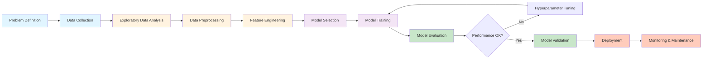
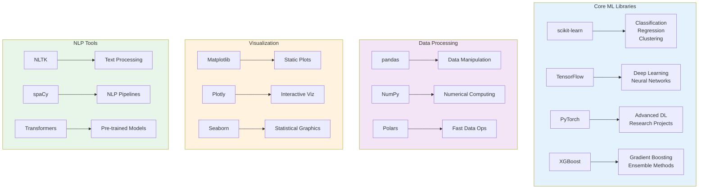
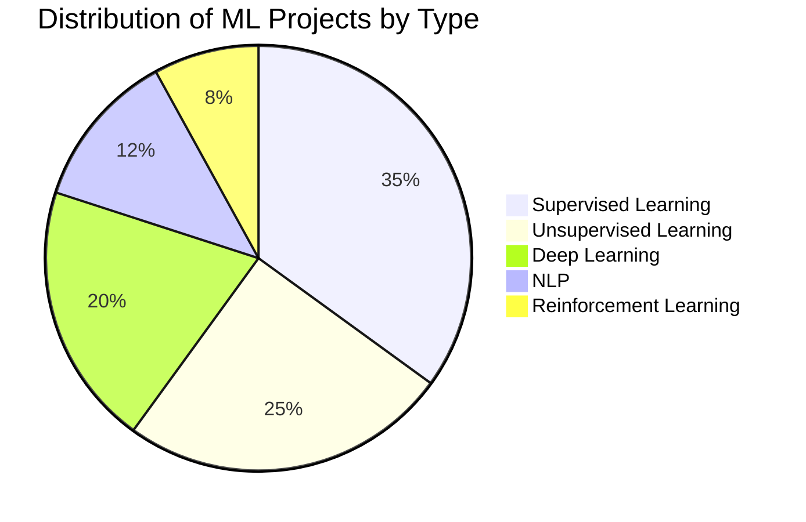
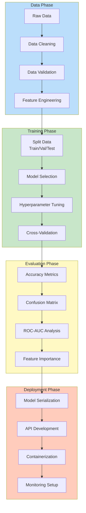
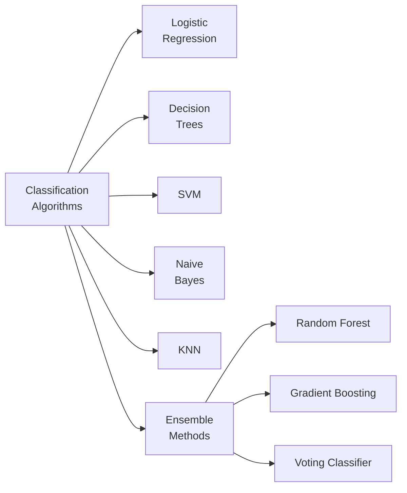
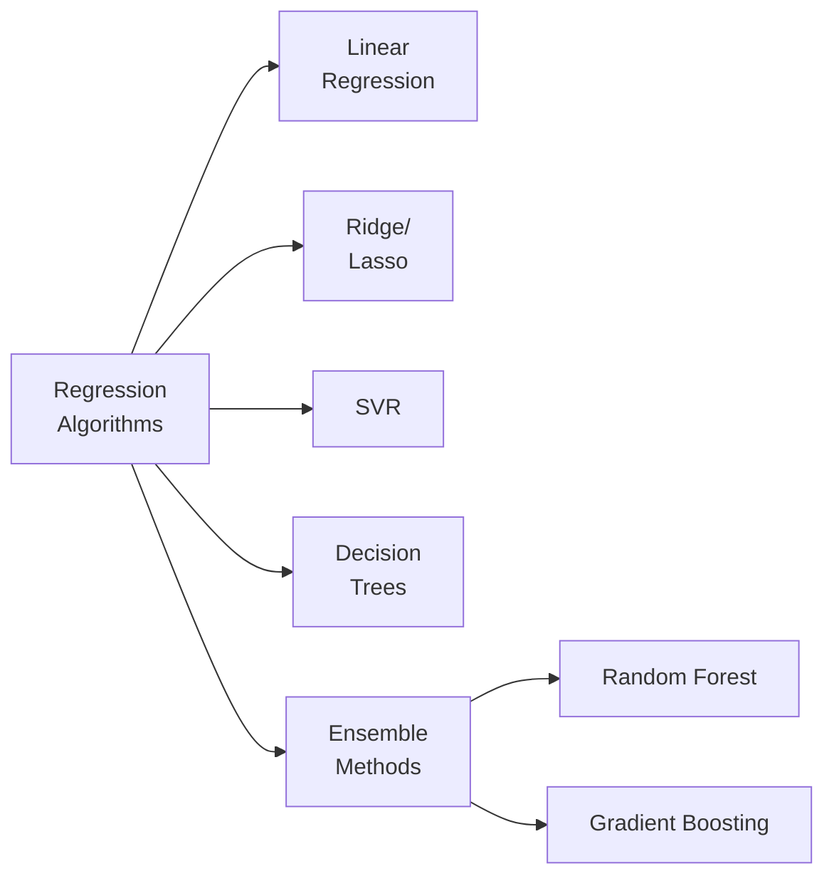

# Machine Learning Projects 01

Welcome to the Machine Learning Projects repository! This collection showcases various machine learning implementations, experiments, and practical applications across different domains.

## 📋 Table of Contents

- [Overview](#overview)
- [Project Structure](#project-structure)
- [ML Workflow](#ml-workflow)
- [Technologies & Tools](#technologies--tools)
- [Getting Started](#getting-started)
- [Projects](#projects)
- [Installation](#installation)
- [Usage](#usage)
- [Contributing](#contributing)
- [License](#license)

## 🎯 Overview

This repository contains a comprehensive collection of machine learning projects, ranging from fundamental algorithms to advanced applications. Each project demonstrates different aspects of the machine learning pipeline, including data preprocessing, feature engineering, model training, evaluation, and deployment considerations.

**Key Focus Areas:**
- Supervised Learning (Regression & Classification)
- Unsupervised Learning (Clustering & Dimensionality Reduction)
- Deep Learning & Neural Networks
- Natural Language Processing
- Computer Vision
- Time Series Analysis
- Recommendation Systems

## 📁 Project Structure

```
Machine_Learning_Projects_01/
├── README.md
├── data/
│   ├── raw/
│   ├── processed/
│   └── external/
├── notebooks/
│   ├── exploratory_data_analysis/
│   ├── model_development/
│   └── experiments/
├── src/
│   ├── preprocessing/
│   ├── models/
│   ├── evaluation/
│   └── utils/
├── results/
│   ├── models/
│   ├── visualizations/
│   └── reports/
├── requirements.txt
└── config/
    └── config.yaml
```

## 🔄 ML Workflow



## 🛠️ Technologies & Tools

### Programming Languages
- **Python 3.8+** - Primary language for all projects
- **SQL** - Data querying and analysis
- **JavaScript** - Web-based visualizations (optional)

### Machine Learning Libraries


### Development & Deployment
- **Jupyter Notebook** - Interactive development
- **Docker** - Containerization
- **Git** - Version control
- **MLflow** - Experiment tracking
- **FastAPI** - Model serving

## 🚀 Getting Started

### Prerequisites
- Python 3.8 or higher
- pip or conda package manager
- Git

### Installation

1. **Clone the repository**
```bash
git clone https://github.com/MuhammadZafran33/Machine_Learning_Projects_01.git
cd Machine_Learning_Projects_01
```

2. **Create a virtual environment**
```bash
# Using venv
python -m venv venv
source venv/bin/activate  # On Windows: venv\Scripts\activate

# Or using conda
conda create -n ml_projects python=3.10
conda activate ml_projects
```

3. **Install dependencies**
```bash
pip install -r requirements.txt
```

4. **Download required datasets**
```bash
python scripts/download_data.py
```

## 📊 Projects

### Project Categories by ML Type



### Detailed Project List

#### 1. **Supervised Learning Projects**
- Linear Regression Models
- Logistic Regression & Classification
- Decision Trees & Random Forests
- Support Vector Machines (SVM)
- Gradient Boosting (XGBoost, LightGBM)
- Neural Networks for Tabular Data

#### 2. **Unsupervised Learning Projects**
- K-Means Clustering
- Hierarchical Clustering
- DBSCAN
- Dimensionality Reduction (PCA, t-SNE, UMAP)
- Anomaly Detection

#### 3. **Deep Learning Projects**
- Convolutional Neural Networks (CNN)
- Recurrent Neural Networks (RNN, LSTM)
- Autoencoders
- Generative Models (VAE, GAN)
- Transfer Learning

#### 4. **Natural Language Processing**
- Text Classification
- Sentiment Analysis
- Named Entity Recognition (NER)
- Machine Translation
- Question Answering Systems

#### 5. **Computer Vision**
- Image Classification
- Object Detection
- Semantic Segmentation
- Face Recognition
- Image Generation

## 💻 Usage

### Running Experiments

```bash
# Navigate to project directory
cd projects/project_name/

# Run Jupyter notebook
jupyter notebook

# Or run Python script
python train.py --config config.yaml
```

### Training a Model

```python
from src.models.classifier import RandomForestClassifier
from src.preprocessing.pipeline import DataPipeline

# Load and preprocess data
pipeline = DataPipeline()
X_train, y_train = pipeline.prepare_training_data('data/raw/train.csv')

# Train model
model = RandomForestClassifier(n_estimators=100)
model.fit(X_train, y_train)

# Evaluate
accuracy = model.score(X_test, y_test)
print(f"Model Accuracy: {accuracy:.4f}")
```

### Making Predictions

```python
# Load trained model
model = load_model('results/models/best_model.pkl')

# Prepare new data
new_data = pipeline.transform('data/raw/test.csv')

# Get predictions
predictions = model.predict(new_data)
probabilities = model.predict_proba(new_data)
```

## 📈 Model Development Pipeline



## 📚 Key Concepts & Algorithms

### Classification Algorithms


### Regression Algorithms


## 📋 Requirements

Key dependencies (see `requirements.txt` for complete list):

```
numpy>=1.21.0
pandas>=1.3.0
scikit-learn>=1.0.0
tensorflow>=2.8.0
torch>=1.10.0
jupyter>=1.0.0
matplotlib>=3.4.0
seaborn>=0.11.0
plotly>=5.0.0
xgboost>=1.5.0
python-dotenv>=0.19.0
```

## 🤝 Contributing

Contributions are welcome! Here's how to contribute:

1. **Fork the repository**
2. **Create a feature branch** (`git checkout -b feature/AmazingFeature`)
3. **Commit your changes** (`git commit -m 'Add some AmazingFeature'`)
4. **Push to the branch** (`git push origin feature/AmazingFeature`)
5. **Open a Pull Request**

### Contribution Guidelines
- Follow PEP 8 style guide
- Include docstrings for all functions
- Add unit tests for new features
- Update README for new projects
- Ensure all tests pass before submitting PR

## 📝 Documentation

Each project includes:
- **README.md** - Project-specific documentation
- **Docstrings** - Code documentation
- **Notebooks** - Exploratory analysis and examples
- **Comments** - Inline code explanations

## 📞 Contact & Support

For questions, suggestions, or issues:
- **GitHub Issues** - Report bugs or request features
- **Email** - Contact through GitHub profile
- **Discussions** - Join community discussions

## 📄 License

This project is licensed under the MIT License - see the LICENSE file for details.

## 🙏 Acknowledgments

- Open-source ML community
- Dataset providers and researchers
- Contributors and collaborators
- Inspirations from Kaggle competitions

---

**Last Updated:** January 1, 2026

**Repository Status:** Active Development ✨

**Total Projects:** 40+

**Last Commit:** [Check Git History]

For more information and updates, star ⭐ this repository!
