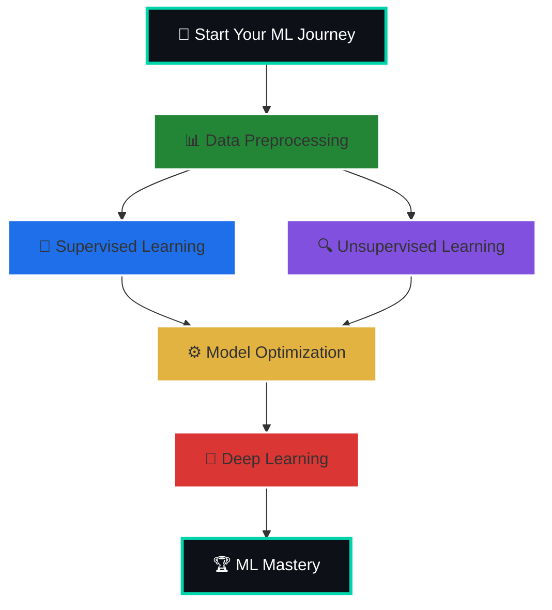

# Welcome to my Machine Learning Projects Repository! 🚀
This repository contains carefully selected ML projects designed to help you learn Machine Learning in depth. Each project focuses on practical implementation, real-world datasets, and essential ML techniques. Whether you are a beginner or looking to solidify your understanding, these projects will guide you through the journey of building strong ML skills, exploring algorithms, and gaining confidence in designing and deploying ML solutions.

## Projects cover areas like:
▶ Supervised & Unsupervised Learning.

▶ Deep Learning & Neural Networks.

▶ Data Preprocessing & Feature Engineering.

▶ Model Evaluation & Optimization

# 🗺️ Project Roadmap:


# 📈 Skill Development Flowchart
```mermaid
flowchart TD
    Start([🎯 Start Here]) --> Prep[📊 Data Preprocessing]
    
    Prep --> SL[🎯 Supervised Learning]
    Prep --> UL[🔍 Unsupervised Learning]
    
    SL --> SL_Sub[Supervised Sub-paths]
    UL --> UL_Sub[Unsupervised Sub-paths]
    
    subgraph SL_Sub[Supervised Learning Path]
        direction LR
        SL1[📈 Regression] --> SL2[🎭 Classification] --> SL3[🤝 Ensemble Methods]
    end
    
    subgraph UL_Sub[Unsupervised Learning Path]
        direction LR
        UL1[👥 Clustering] --> UL2[📐 Dimensionality Reduction] --> UL3[🔮 Anomaly Detection]
    end
    
    SL_Sub --> Opt[⚙️ Model Optimization]
    UL_Sub --> Opt
    
    Opt --> DL[🧠 Deep Learning]
    
    DL --> DL_Sub[Deep Learning Specializations]
    
    subgraph DL_Sub[Deep Learning Path]
        direction LR
        DL1[🧬 Neural Networks] --> DL2[🖼️ Computer Vision] --> DL3[📝 NLP] --> DL4[🎵 Sequence Models]
    end
    
    DL_Sub --> Deploy[🚀 Deployment]
    Deploy --> Mastery[🏆 ML Mastery]
    
    %% Styling
    classDef green fill:#238636,stroke:#fff,stroke-width:2px,color:#fff
    classDef blue fill:#1F6FEB,stroke:#fff,stroke-width:2px,color:#fff
    classDef purple fill:#8250DF,stroke:#fff,stroke-width:2px,color:#fff
    classDef yellow fill:#E3B341,stroke:#fff,stroke-width:2px,color:#000
    classDef red fill:#DA3633,stroke:#fff,stroke-width:2px,color:#fff
    classDef black fill:#0D1117,stroke:#00D4AA,stroke-width:3px,color:#fff
    
    ```
