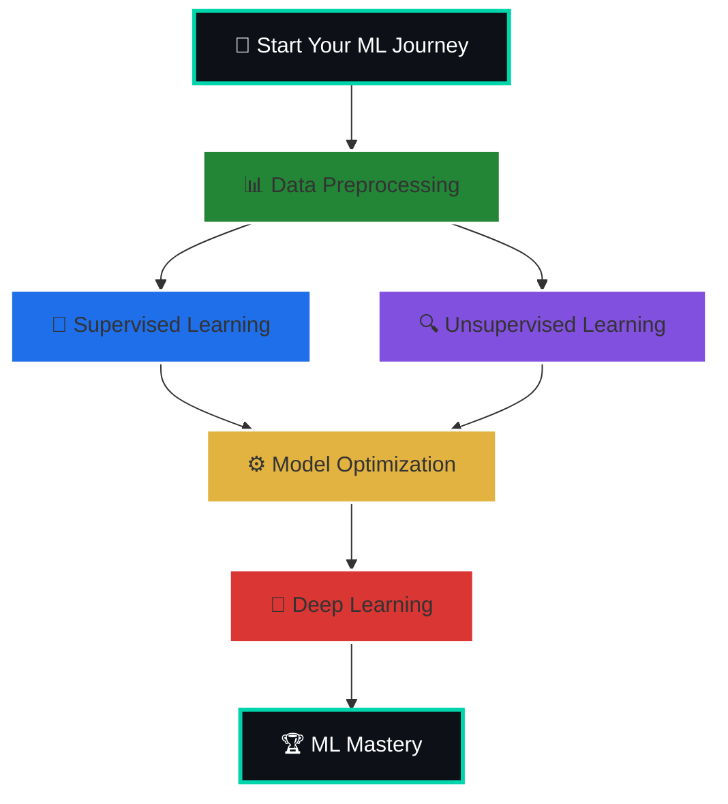

# Welcome to my Machine Learning Projects Repository! 🚀
This repository contains carefully selected ML projects designed to help you learn Machine Learning in depth. Each project focuses on practical implementation, real-world datasets, and essential ML techniques. Whether you are a beginner or looking to solidify your understanding, these projects will guide you through the journey of building strong ML skills, exploring algorithms, and gaining confidence in designing and deploying ML solutions.

## Projects cover areas like:
▶ Supervised & Unsupervised Learning.

▶ Deep Learning & Neural Networks.

▶ Data Preprocessing & Feature Engineering.

▶ Model Evaluation & Optimization

# 🗺️ Project Roadmap:

    
  
