# Welcome to my Machine Learning Projects Repository! 🚀
This repository contains carefully selected ML projects designed to help you learn Machine Learning in depth. Each project focuses on practical implementation, real-world datasets, and essential ML techniques. Whether you are a beginner or looking to solidify your understanding, these projects will guide you through the journey of building strong ML skills, exploring algorithms, and gaining confidence in designing and deploying ML solutions.

## Projects cover areas like:
▶ Supervised & Unsupervised Learning.

▶ Deep Learning & Neural Networks.

▶ Data Preprocessing & Feature Engineering.

▶ Model Evaluation & Optimization

# 🗺️ Project Roadmap:

```mermaid
graph TD
    A[🚀 Start Your ML Journey] --> B[📊 Data Preprocessing]
    B --> C[🎯 Supervised Learning]
    B --> D[🔍 Unsupervised Learning]
    C --> E[⚙️ Model Optimization]
    D --> E
    E --> F[🧠 Deep Learning]
    F --> G[🏆 ML Mastery]
    
    style A fill:#0D1117,stroke:#00D4AA,stroke-width:3px,color:#fff
    style B fill:#238636,stroke:#fff,stroke-width:2px
    style C fill:#1F6FEB,stroke:#fff,stroke-width:2px
    style D fill:#8250DF,stroke:#fff,stroke-width:2px
    style E fill:#E3B341,stroke:#fff,stroke-width:2px
    style F fill:#DA3633,stroke:#fff,stroke-width:2px
    style G fill:#0D1117,stroke:#00D4AA,stroke-width:3px,color:#fff

```



# Machine Learning Projects 01

Welcome to the Machine Learning Projects repository! This collection showcases various machine learning implementations, experiments, and practical applications across different domains.

## 📋 Table of Contents

- [Overview](#overview)
- [Project Structure](#project-structure)
- [ML Workflow](#ml-workflow)
- [Technologies & Tools](#technologies--tools)
- [Getting Started](#getting-started)
- [Projects](#projects)
- [Installation](#installation)
- [Usage](#usage)
- [Contributing](#contributing)
- [License](#license)

## 🎯 Overview

This repository contains a comprehensive collection of machine learning projects, ranging from fundamental algorithms to advanced applications. Each project demonstrates different aspects of the machine learning pipeline, including data preprocessing, feature engineering, model training, evaluation, and deployment considerations.

**Key Focus Areas:**
- Supervised Learning (Regression & Classification)
- Unsupervised Learning (Clustering & Dimensionality Reduction)
- Deep Learning & Neural Networks
- Natural Language Processing
- Computer Vision
- Time Series Analysis
- Recommendation Systems

## 📁 Project Structure
Machine_Learning_Projects_01/ ├── README.md ├── data/ │ ├── raw/ │ ├── processed/ │ └── external/ ├── notebooks/ │ ├── exploratory_data_analysis/ │ ├── model_development/ │ └── experiments/ ├── src/ │ ├── preprocessing/ │ ├── models/ │ ├── evaluation/ │ └── utils/ ├── results/ │ ├── models/ │ ├── visualizations/ │ └── reports/ ├── requirements.txt └── config/ └── config.yaml
    

## 🔄 ML Workflow

```mermaid
graph LR
    A[Problem Definition] --> B[Data Collection]
    B --> C[Exploratory Data Analysis]
    C --> D[Data Preprocessing]
    D --> E[Feature Engineering]
    E --> F[Model Selection]
    F --> G[Model Training]
    G --> H[Model Evaluation]
    H --> I{Performance OK?}
    I -->|No| J[Hyperparameter Tuning]
    J --> G
    I -->|Yes| K[Model Validation]
    K --> L[Deployment]
    L --> M[Monitoring & Maintenance]
    
    style A fill:#e1f5ff
    style B fill:#e1f5ff
    style C fill:#fff3e0
    style D fill:#fff3e0
    style E fill:#fff3e0
    style F fill:#f3e5f5
    style G fill:#f3e5f5
    style H fill:#c8e6c9
    style K fill:#c8e6c9
    style L fill:#ffccbc
    style M fill:#ffccbc


graph TB
    subgraph Core["Core ML Libraries"]
        A[scikit-learn] --> A1["Classification<br/>Regression<br/>Clustering"]
        B[TensorFlow] --> B1["Deep Learning<br/>Neural Networks"]
        C[PyTorch] --> C1["Advanced DL<br/>Research Projects"]
        D[XGBoost] --> D1["Gradient Boosting<br/>Ensemble Methods"]
    end
    
    subgraph DataTools["Data Processing"]
        E[pandas] --> E1["Data Manipulation"]
        F[NumPy] --> F1["Numerical Computing"]
        G[Polars] --> G1["Fast Data Ops"]
    end
    
    subgraph Viz["Visualization"]
        H[Matplotlib] --> H1["Static Plots"]
        I[Plotly] --> I1["Interactive Viz"]
        J[Seaborn] --> J1["Statistical Graphics"]
    end
    
    subgraph NLP["NLP Tools"]
        K[NLTK] --> K1["Text Processing"]
        L[spaCy] --> L1["NLP Pipelines"]
        M[Transformers] --> M1["Pre-trained Models"]
    end
    
    style Core fill:#e3f2fd
    style DataTools fill:#f3e5f5
    style Viz fill:#fff3e0
    style NLP fill:#e8f5e9

git clone https://github.com/MuhammadZafran33/Machine_Learning_Projects_01.git
cd Machine_Learning_Projects_01

